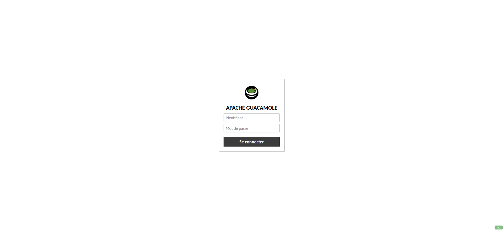

# Guide de gestion des utilisateurs et des groupes dans Guacamole

Ce guide explique les tâches d'administration de base après connexion à l'interface Guacamole.

## 1. Connexion en tant qu'administrateur

- Ouvrez votre navigateur et accédez à : `http://localhost:8043/guacamole/`
- Connectez-vous avec les identifiants par défaut :

```text
Utilisateur : guacadmin
Mot de passe : guacadmin
```
- Cliquez sur votre nom d'utilisateur (en haut à droite) puis sélectionnez **Paramètres**.

## 2. Changer le mot de passe de l'utilisateur Admin

La première étape de sécurité est de changer le mot de passe de `guacadmin` (ou d'un autre compte administrateur).

1. Dans **Paramètres**, ouvrez l'onglet **Utilisateurs**.
2. Cliquez sur l'utilisateur `guacadmin`.
3. Dans l'édition de l'utilisateur, renseignez le nouveau mot de passe et confirmez-le.
4. Cliquez sur **Enregistrer** (vous devrez peut-être vous reconnecter).

## 3. Créer des utilisateurs standards

Ce chapitre explique comment ajouter de nouveaux utilisateurs.

### Création de l'utilisateur

1. Dans **Paramètres** → **Utilisateurs**, cliquez sur **Nouvel utilisateur**.
2. Dans l'onglet **Propriétés** :
   - **Nom d'utilisateur** : ex. `marc`
   - **Mot de passe** : saisissez et confirmez le mot de passe initial.
3. Cliquez sur **Enregistrer**.

### Attribution des permissions (connexions)

Un utilisateur doit avoir au moins une permission sur une connexion pour y accéder.

1. Depuis la page d'édition de l'utilisateur, ouvrez l'onglet **Permissions**.
2. Dans **Connexions**, cochez les connexions auxquelles l'utilisateur doit accéder.
3. Assurez-vous que l'autorisation **Lecture** est cochée.
4. Cliquez sur **Enregistrer**.

## 4. Gérer les groupes d'utilisateurs

Les groupes permettent d'attribuer des permissions à plusieurs utilisateurs en une seule opération.

### 4.1 Créer un nouveau groupe

1. Dans **Paramètres** → **Groupes**, cliquez sur **Nouveau groupe**.
2. Dans **Propriétés**, définissez un nom clair (ex. `Administrateurs-Réseau`).
3. Cliquez sur **Enregistrer**.

### 4.2 Attribuer des permissions au groupe

1. Depuis la page d'édition du groupe, ouvrez l'onglet **Permissions**.
2. Dans **Connexions**, cochez les connexions ou groupes de connexions souhaités.
3. Cliquez sur **Enregistrer**.

### 4.3 Ajouter des utilisateurs au groupe

1. Dans **Paramètres** → **Utilisateurs**, ouvrez l'utilisateur à ajouter.
2. Ouvrez l'onglet **Groupes** et cochez le groupe approprié.
3. Cliquez sur **Enregistrer**. L'utilisateur hérite alors des permissions du groupe.

---

## Images

Les images du dossier `images/` ont été ajoutées ci-dessous. Elles n'étaient pas référencées dans le document initial.

> Aperçu rapide :




---

Si vous souhaitez un affichage en grille, des vignettes redimensionnées, ou des légendes détaillées pour chaque image, dites-le et j'ajusterai la section `Images` en conséquence.