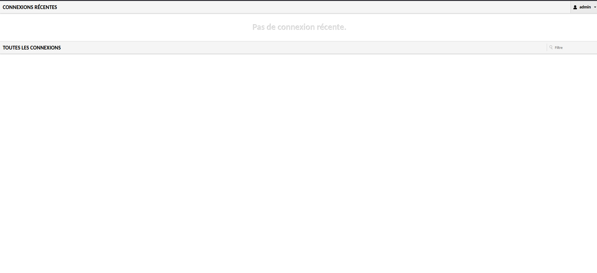
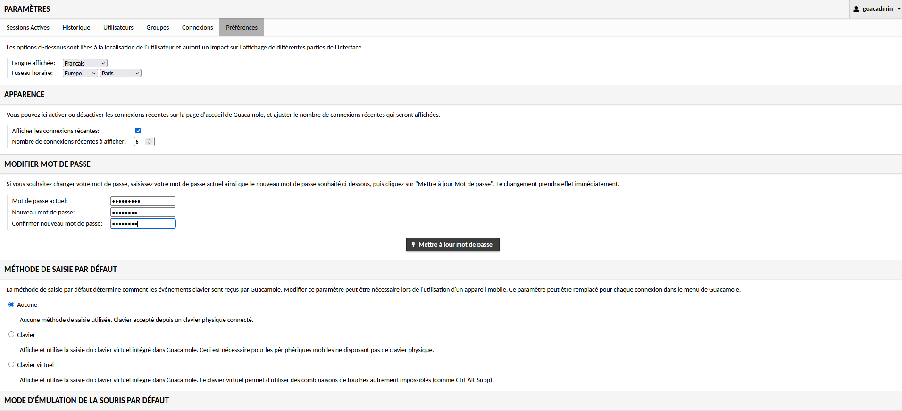
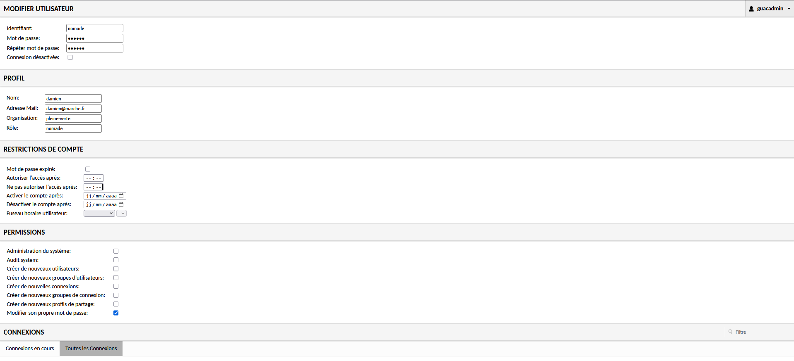
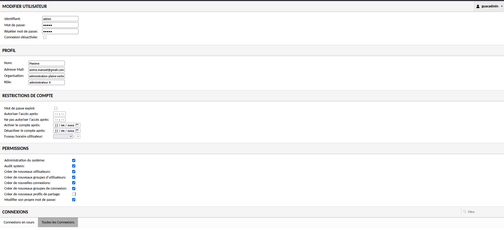
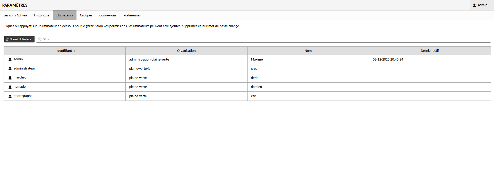
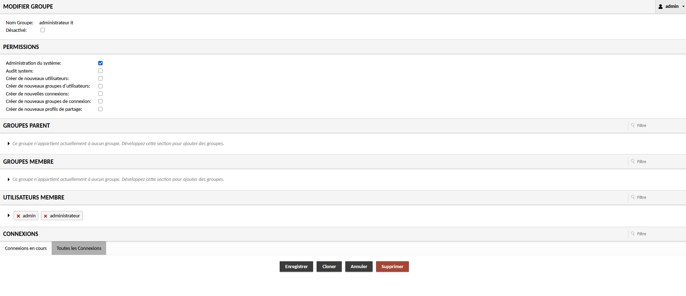
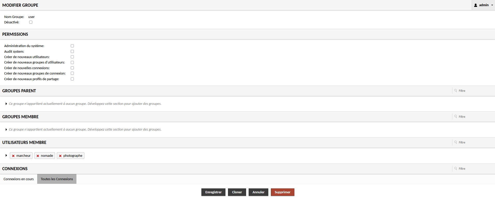
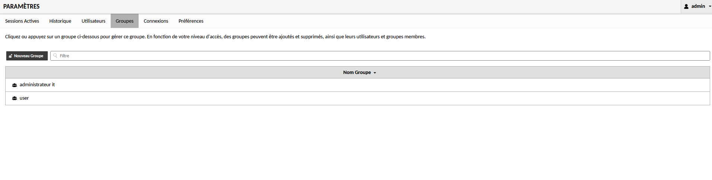

````markdown
# User and Group Management Guide for Guacamole

This guide explains basic administrative tasks after logging into the Guacamole web interface.

## 1. Log in as administrator

- Open your browser and go to: `http://localhost:8043/guacamole/`
- Sign in with default credentials:

```text
Username: guacadmin
Password: guacadmin
```




- Click your username (top-right) and select **Settings**.

## 2. Change the Admin password

The first security step is to change the `guacadmin` password (or the password of any admin account).

1. In **Settings**, open the **Users** tab.
2. Click the `guacadmin` user.
3. In the user edit form, enter and confirm the new password.
4. Click **Save** (you may need to log in again).



## 3. Create regular users

This section explains how to add new users.

### Creating a user

1. In **Settings** → **Users**, click **New User**.
2. Under **Properties**:
   - **Username**: e.g. `marc`
   - **Password**: set and confirm an initial password.
3. Click **Save**.

### Assigning connection permissions

A user must have at least one permission on a connection to access it.

1. From the user's edit page, open the **Permissions** tab.
2. Under **Connections**, check the connections the user should access.
3. Ensure the **Read** permission is checked.
4. Click **Save**.







## 4. Manage user groups

Groups allow assigning permissions to multiple users at once.

### 4.1 Create a new group

1. In **Settings** → **Groups**, click **New Group**.
2. In **Properties**, enter a clear name (e.g. `Network-Admins`).
3. Click **Save**.

### 4.2 Assign permissions to a group

1. From the group's edit page, open the **Permissions** tab.
2. Under **Connections**, check the desired connections or connection groups.
3. Click **Save**.

### 4.3 Add users to a group

1. In **Settings** → **Users**, open the user you want to add.
2. Open the **Groups** tab and check the appropriate group.
3. Click **Save**. The user will inherit the group's permissions.







````
